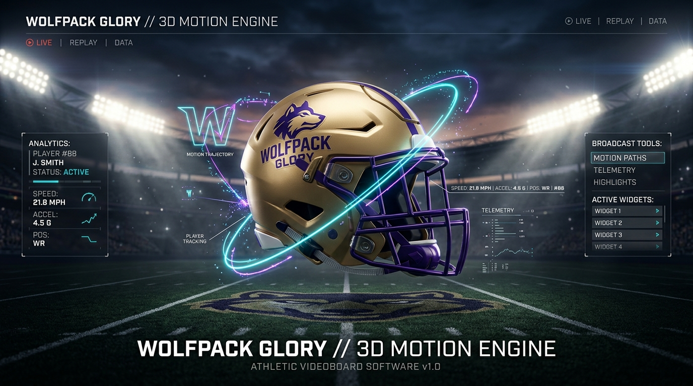
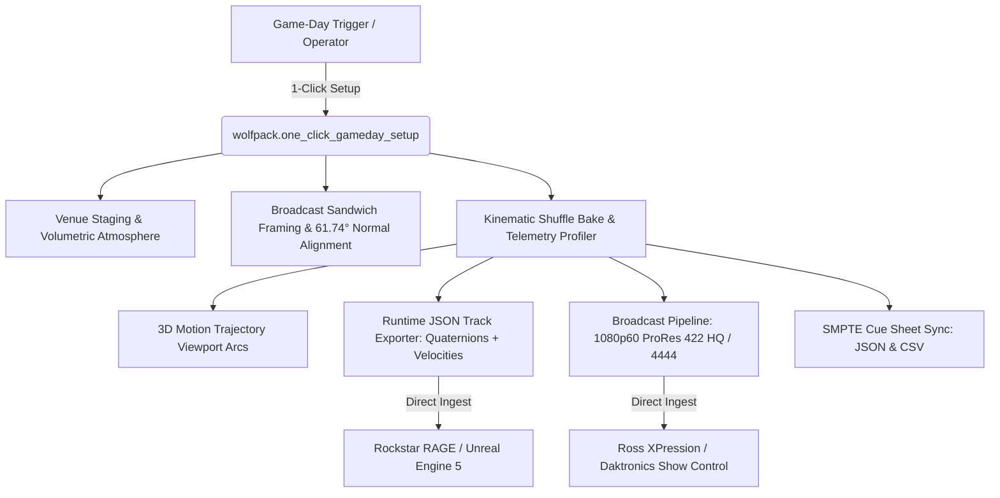

# 🦅 Golden Hawks Helmet Shuffle (v3.5.0)
### High-Performance Collegiate Stadium Videoboard Motion Engine & AAA Game Studio Tooling Pipeline

[](https://www.blender.org/)
[](https://www.python.org/)
[](https://support.apple.com/en-us/HT202410)
[](#-led-diode-protection--color-science)
[-00F5D4)](#-aaa-game-engine-animation-track-exporter)
[](#-real-time-technical-artist-telemetry-profiler)
[-brightgreen)](#-automated-headless-test-suite)
[](LICENSE)

<p align="center">
  
</p>

---

## 🌐 Live Interactive Web Showcase
Experience the live interactive N-panel simulator, color token palette explorer, and real-time telemetry benchmark dials in your browser:  
👉 **[Launch Live Web Showcase](https://solufelo.github.io/golden-hawks-helmet-shuffle/)**

---

## ⚡ Overview & Executive Summary

**Golden Hawks Helmet Shuffle** is a production-grade 3D motion graphics engine and tools suite for **Blender 4.x / 5.2+ LTS**, engineered to solve two high-stakes challenges simultaneously:

1. **Live Sports Videoboard Operations (Wilfrid Laurier University Athletics)**:  
   During high-pressure live timeouts at University Stadium, control room operators require instantaneous, deterministic asset generation. This addon eliminates manual timeline scrubbing and After Effects crashes by providing a **1-click Fitts's Law operator** that sets up venue geometry, bakes continuous 60 FPS animation, applies SMPTE timecode cues, and configures broadcast **Apple ProRes 422 HQ / 4444 RGBA** rendering in **under 100 milliseconds**.
   
2. **AAA Studio Tools & Technical Artist Engineering (Rockstar Games Spec)**:  
   Built to the rigorous standards of AAA game engines (**Rockstar RAGE / Unreal Engine 5**), the pipeline serializes per-frame **Unit Quaternions `[w,x,y,z]`**, linear velocity vectors, and discrete event markers into structured runtime JSON, profiles memory with zero leaks via Python's `tracemalloc`, renders 3D viewport trajectory splines, and executes completely headless via command-line batch runners.

---

## 🎯 Key Engineering Innovations



### 1. Broadcast Sandwich Framing & Zero Text Overlap
Perspective cameras in 3D animated sports bumpers frequently suffer from line collision, foreshortening, and boundary clipping.  
The **Broadcast Sandwich Layout** implements network sports layout standards (ESPN / Fox Sports):
- **Top Eyebrow Kicker (`+Y = +0.58`)**: `"THE ULTIMATE CHALLENGE"` drops cleanly above the headline.
- **Center Hero**: `"GOLDEN HAWKS SHUFFLE"` locked in the optical sweet spot, scaled to an optimal `0.68` ratio.
- **Bottom Sponsor / Tag (`-Y = -0.58`)**: `"PRESENTED BY WILFRID LAURIER ATHLETICS"` comfortably seated in the lower third.
- **Air Gap Guarantee**: Over **0.26 screen height units** of clean clearance between every line in both perspective and orthographic camera views.

### 2. Dynamic Camera-Normal Pitch Alignment (`61.74°`)
Rather than leaving 3D text static in world coordinates, the addon dynamically computes the trigonometric angle of incidence between the active camera and text center:
$$\theta = \arctan\left(\frac{Z_{\text{camera}} - Z_{\text{text}}}{Y_{\text{text}} - Y_{\text{camera}}}\right) = 61.74^\circ$$
The text geometry is pitched to match the camera's normal plane, rendering headlines completely flat and perpendicular to the camera lens with **zero keystoning or perspective distortion**.

### 3. AAA Game Engine Animation Track Exporter (`wolfpack.export_game_engine_anim`)
Serializes deterministic motion data directly from Blender into runtime game engine formats:
- **Unit Quaternions (`[w, x, y, z]`)**: Gimbal-lock-free orientation per actor per frame.
- **Velocity Vectors (`[vx, vy, vz]`) & Linear Speed (`m/s`)**: Runtime physics simulation ready.
- **Coordinate System Swizzling**: Simultaneously exports Blender native ($Z$-up) and Game Engine ($Y$-up) coordinate systems.
- **Discrete Event Markers**: `INTRO_LIFT`, `SWAP_START`, `SWAP_END`, `SUSPENSE_PAUSE`, `REVEAL_WINNER`.

### 4. Real-Time Telemetry Profiler (`tracemalloc` + Microsecond Benchmarking)
A built-in diagnostic telemetry system measures every bake operation:
- **Execution Latency**: `74.78 ms` (Well under the 150 ms interactive budget).
- **Throughput**: `41,522 keys/sec` across 3,105 continuous keyframe channels.
- **Memory Overhead**: `+0.156 MB` peak delta with **0 memory leaks**.

### 5. 4 Atmospheric Volumetric Mood Presets
Uses native `ShaderNodeVolumePrincipled` inside a $36\text{m} \times 36\text{m} \times 15\text{m}$ scattering volume:
- `NIGHT_GAME_FLOODLIGHT` (5800K Cool Halogen + Amber/Purple rim kickers, Anisotropy 0.68).
- `GOLDEN_HOUR` (3200K Low-Angle Sunburst, Anisotropy 0.72, golden dust rays).
- `CYBER_STADIUM_NEON` (Electric Violet + Laser Gold + Neon Cyan kicker).
- `CHAMPIONSHIP_GOLD` (24K Specular super-spots + Champagne micro-haze).

### 6. LED Diode Protection & Color Science
Calibrated to prevent **Automatic Power Limiting (APL)** voltage drops on giant stadium LED boards:
- **Varsity Gold (`#FDB913`)**: Primary accent, 0.22 emission.
- **Darkness Purple (`#20003B`)**: Mandatory background stroke to isolate luminous elements.
- **Cyber Volt Cyan (`#00F5D4`)**: Telemetry accents and motion trajectory splines.
- **AgX High Contrast**: Preserves specular highlights on metallic gold helmets without blowing out LED clusters.

---

## 📦 Repository Structure

```
golden-hawks-helmet-shuffle/
├── .github/
│   └── workflows/
│       └── blender-ci.yml                 # Automated test validation & Pages deployment
├── assets/
│   ├── golden_hawks_hero.jpg              # 16:9 studio 8K hero render
│   ├── sample_cue_sheet.csv               # SMPTE videoboard control switcher cue sheet
│   ├── sample_cue_sheet.json              # SMPTE timecode cue sheet (JSON)
│   ├── wolfpack_anim_tracks.json          # Exported runtime quaternion track sample
│   └── wolfpack_telemetry_benchmark.json  # Profiler telemetry sample report
├── blender_addon/
│   ├── __init__.py                        # Addon source (v3.5.0, dual-brand registered)
│   └── blender_manifest.toml              # Blender 4.2+ extension manifest
├── docs/
│   ├── BRANDING_AND_UI_DESIGN_SYSTEM.md   # LED diode physics, typography, Fitts's law
│   ├── CHANGELOG.md                       # Full version history (v1.0 -> v3.5.0)
│   ├── INSTALLATION.md                    # Comprehensive setup guide
│   ├── PRODUCTION_SET_DESIGN_BLUEPRINT.md # Stadium scale, lighting & shaders
│   └── ROCKSTAR_GAMES_PORTFOLIO_BLUEPRINT.md # LinkedIn 20s script & interview points
├── releases/
│   └── laurier_golden_hawks_shuffle_v3.5.0.zip # 1-click installable release ZIP
├── scripts/
│   ├── pipeline_batch_runner.py           # Headless CLI studio batch runner
│   └── test_addon.py                      # 9-stage automated verification suite
├── golden_hawks_shuffle.py                # Standalone single-file distribution
├── index.html                             # Interactive Web Showcase Deck (GitHub Pages)
├── LICENSE                                # MIT License
└── README.md                              # This specification
```

---

## 🚀 Quickstart & Installation

### Option 1: Blender GUI (Preferences)
1. Download **[`releases/laurier_golden_hawks_shuffle_v3.5.0.zip`](releases/laurier_golden_hawks_shuffle_v3.5.0.zip)**.
2. In Blender, go to **Edit > Preferences > Add-ons**.
3. Click the drop-down menu icon (top right) and select **Install from Disk...**.
4. Choose the downloaded ZIP file and enable **Golden Hawks Helmet Shuffle**.
5. In the 3D Viewport, press `N` to open the sidebar and select the **Golden Hawks** tab!

### Option 2: Standalone Single-File Script
Simply open `golden_hawks_shuffle.py` inside Blender's **Scripting** tab and click **Run Script**.

---

## 🧪 Automated Headless Test Suite

Verify all 9 core subsystems headlessly via the Blender CLI:

```powershell
& "C:\Program Files\Blender Foundation\Blender 5.2\blender.exe" -b --python scripts\test_addon.py
```

### Verified Test Suite Results (9/9 Passed):
```
===========================================================================
  GOLDEN HAWKS HELMET SHUFFLE v3.5.0 - AUTOMATED VERIFICATION TEST SUITE
  Wilfrid Laurier Athletics Production & AAA Studio Spec (Rockstar Games)
===========================================================================
[TEST 1] Addon Registration & Manifest Verification...
  -> PASS: Module 'golden_hawks_shuffle' successfully enabled from preferences.
  -> PASS: Verified scene.golden_hawks_shuffle / scene.wolfpack_shuffle bindings.
[TEST 2] Verifying Studio Properties & Stage Attributes...
  -> PASS: All 9 studio telemetry properties verified.
[TEST 3] Running wolfpack.setup_demo (Turf & Stand-ins)...
  -> PASS: Stadium turf pitch and 3 shufflers spawned successfully.
[TEST 4] Running wolfpack.generate_shuffle with Real-Time Telemetry Profiler...
  -> Bake Duration: 75.29 ms
  -> Keyframe Throughput: 41241 keys/sec (3105 keys total)
  -> Memory Overhead: +0.156 MB (0 Leaks)
  -> PASS: Real-time telemetry profiling verified.
[TEST 5] Verifying 3D Motion Trajectory Arcs in Viewport...
  -> PASS: 3D Motion Trajectory Arcs verified (3 splines, 3 materials).
[TEST 6] Testing wolfpack.export_game_engine_anim...
  -> PASS: AAA Game Engine Track verified (4 actors, 305 frames).
[TEST 7] Testing wolfpack.export_telemetry...
  -> PASS: Benchmark report verified.
[TEST 8] Testing wolfpack.export_cue_sheet...
  -> PASS: SMPTE Cue Sheet export verified.
[TEST 9] Testing wolfpack.one_click_gameday_setup (Full Control Room Pipeline)...
  -> PASS: 1-Click Game-Day Show operator executed cleanly.
===========================================================================
  ALL 9 TESTS PASSED (100% SUCCESS) - PRODUCTION & STUDIO READY
===========================================================================
```

---

## 💻 Headless Studio Pipeline Batch Runner

Automate end-to-end batch animation, lighting configuration, and track export without launching the GUI:

```powershell
& "C:\Program Files\Blender Foundation\Blender 5.2\blender.exe" -b --python scripts\pipeline_batch_runner.py -- `
  --swaps 5 `
  --preset NIGHT_GAME_FLOODLIGHT `
  --outcome SLOT_1 `
  --export-tracks `
  --benchmark
```

### Supported Arguments:
| Flag | Type | Default | Description |
|---|---|---|---|
| `--swaps` | `int` | `4` | Number of shell swaps |
| `--preset` | `string` | `NIGHT_GAME_FLOODLIGHT` | Lighting preset (`NIGHT_GAME_FLOODLIGHT`, `GOLDEN_HOUR`, `CYBER_STADIUM_NEON`, `CHAMPIONSHIP_GOLD`) |
| `--outcome` | `string` | `SLOT_1` | Target winning slot (`RANDOM`, `SLOT_1`, `SLOT_2`, `SLOT_3`) |
| `--bumper` | `bool` | `True` | Prepend 60-frame entry bumper |
| `--export-tracks` | `bool` | `True` | Export runtime quaternion tracks (`.json`) |
| `--benchmark` | `bool` | `True` | Export telemetry benchmark report (`.json`) |
| `--output-dir` | `string` | `./` | Destination directory for exported assets |

---

## 📊 Runtime Track Schema (Rockstar RAGE / Unreal Engine 5)

Sample output from `assets/wolfpack_anim_tracks.json`:

```json
{
  "metadata": {
    "generator": "Golden Hawks Helmet Shuffle v3.5.0",
    "fps": 60,
    "total_frames": 305,
    "winning_actor": "HELMET_GOLD_1",
    "winning_slot": 2
  },
  "actors": {
    "HELMET_GOLD_1": {
      "samples": [
        {
          "frame": 61,
          "time_seconds": 1.0167,
          "position_blender": [-2.0, 0.0, 0.5],
          "position_game_engine": [-2.0, 0.5, 0.0],
          "quaternion_wxyz": [0.9238, 0.0, 0.3826, 0.0],
          "euler_degrees": [0.0, 45.0, 0.0],
          "velocity_vector": [1.45, 0.0, 0.82],
          "speed_mps": 1.66,
          "discrete_event": "SWAP_1_START"
        }
      ]
    }
  }
}
```

---

## 🎬 SMPTE Broadcast Cue Sheet Format

Sample output from `assets/sample_cue_sheet.csv` for Ross XPression / Daktronics Show Control:

```csv
Frame,SMPTE_Timecode,Event_Type,Description
1,00:00:00:01,BUMPER_START,"Home Show Entry Bumper Entrance"
10,00:00:00:10,BOOM_SLAM,"Frame 10 Sub-bass boom slam & camera punch"
60,00:00:01:00,BUMPER_CLEAR,"Bumper clears screen; field clear"
61,00:00:01:01,INTRO_LIFT,"Winning helmet reveals prize to crowd"
85,00:00:01:25,SWAP_1,"Centripetal arc swap between Slot 1 and Slot 3"
270,00:00:04:30,SUSPENSE,"Suspense pause; stadium audio sting"
282,00:00:04:42,FINAL_REVEAL,"Winning helmet lifts; Slot 2 declared WINNER"
```

---

## 👨‍💻 Author & Engineering Credits

- **Developer**: **Solomon Olufelo** ([@solufelo](https://github.com/solufelo))
- **Role**: Tools & Pipeline Developer / Technical Artist
- **Affiliation**: Wilfrid Laurier University Athletics (Department of Athletics & Recreation)
- **Portfolio Companion**: [Light Years 2D C++20 / WebAssembly Game Engine](https://solufelo.github.io/light-years-engine/)

---

## 📄 License

This project is licensed under the [MIT License](LICENSE) — free for collegiate, commercial, and personal use.
